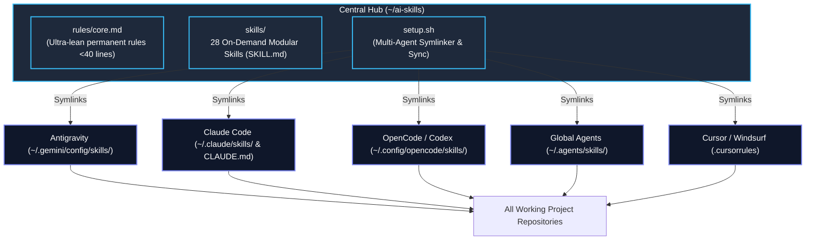

# AI Engineering Skills Hub (`ai-skills`) — v2.0

[](https://github.com/hvtrk/ai-skill-rules)
[](https://github.com/hvtrk/ai-skill-rules)
[](https://opensource.org/licenses/MIT)

A centralized, portable, and ultra-lean AI skills repository for modern software engineering workflows.

Designed for high performance, zero context bloat, and universal compatibility across **Antigravity**, **Claude Code**, **OpenCode / Codex**, and **Cursor / Windsurf**.

---

## ⚡ What's New in v2.0

| Feature | v1 (Legacy) | v2.0 (Current) |
| :--- | :--- | :--- |
| **Context Footprint** | Monolithic eager-loading of all rules & playbooks (~10k+ tokens on startup) | **Ultra-lean base rules (<40 lines)** + on-demand skill discovery (~200 tokens) |
| **Skill Format** | Flat Markdown playbooks with repeated principles | **Standardized `SKILL.md`** with semantic discovery & metadata headers |
| **Multi-Agent Setup** | Manual copy-pasting of `.agents/` folder per project | **1-Command multi-harness installer (`setup.sh`)** for Antigravity, Claude, Codex, Cursor, and `~/.agents` |
| **Curated Suite** | Overlapping playbooks and ad-hoc guidelines | **28 dedicated, non-overlapping skills** covering architecture, backend, frontend, databases, TDD, and agent development |
| **Skill Authoring & Sync** | Manual file creation | **Built-in `skill-creator` & `skill-harness-sync`** for instant npx skill imports & multi-agent distribution |

---

## 🧠 Architecture Overview



---

## 🚀 Quickstart

### 1. Global Multi-Agent Installation (1 Command)
```bash
# Clone the repository
git clone git@github.com:hvtrk/ai-skill-rules.git ~/ai-skills

# Run the installer
cd ~/ai-skills
chmod +x setup.sh
./setup.sh --global
```
*All 28 skills and rules immediately activate across all your agent harnesses (Antigravity, Claude Code, OpenCode, and `~/.agents`).*

### 2. Link into a Specific Project Repository
If a specific repository requires local `.agents/skills`, `.agents/rules.md`, or `.cursorrules`:
```bash
# Run from within ~/ai-skills:
./setup.sh --project /path/to/repo

# Or directly using the absolute path from anywhere:
~/path/to/repo/ai-skills/setup.sh --project /path/to/repo
```

### 3. Check Sync Status
To verify all symlinks across all agent harnesses:
```bash
~/ai-skills/setup.sh --status
```

### 4. Importing New Skills from `npx skills add`
When you install third-party skills using `npx skills add <source> -g`, import and distribute them into your version-controlled hub:
```bash
# Import new unmanaged skills from ~/.agents/skills
~/ai-skills/setup.sh --import

# Synchronize globally across all harnesses
~/ai-skills/setup.sh --global
```

### 5. Dry-Run Mode
To preview symlinks without modifying the filesystem:
```bash
./setup.sh --dry-run
```

---

## 📁 Repository Layout

```text
~/ai-skills/
├── README.md                  # Comprehensive v2 documentation
├── setup.sh                   # Multi-agent symlinker, importer & synchronizer
├── rules/
│   └── core.md                # Ultra-compact universal engineering rules (<40 lines)
├── skills/                    # 28 Curated Modular Skills (SKILL.md)
│   ├── fullstack-feature/     # End-to-end FastAPI + Next.js feature scaffolding
│   ├── fastapi-backend/       # Layered API: public/protected/service/repository
│   ├── nextjs-frontend/       # React 19, App Router, Tailwind v4, TanStack Query
│   ├── db-migration-schema/   # SQLModel schemas, PostgreSQL migrations & indexing
│   ├── supabase/              # Supabase products, auth, SSR, edge functions, storage
│   ├── supabase-postgres-best-practices/ # Postgres indexing, query optimization & RLS
│   ├── design-it/             # 30 Distinct aesthetic UI design systems
│   ├── redesign-existing-projects/ # UI/UX aesthetic audit & visual restyling
│   ├── codebase-audit-pre-push/# Pre-push git cleaner, secret scanner, and hygiene
│   ├── performance-optimizer/ # Profiling, database indexes, API latency, memoization
│   ├── systematic-debugging/  # 6-phase debugging loop & common pattern fixes
│   ├── improve-codebase-architecture/# Architectural friction scanner & seam creation
│   ├── code-review/           # Architecture consistency & PR review playbook
│   ├── logic-lens/            # Formal reasoning & logic-based code analysis
│   ├── tdd/                   # Test-driven development (red-green-refactor loop)
│   ├── domain-modeling/       # DDD domain context, glossary & ADR generator
│   ├── to-spec/               # Conversation synthesis into structured specs
│   ├── to-tickets/            # Tracer-bullet ticket generator with dependency edges
│   ├── prototype/             # Throwaway spikes & rapid terminal/UI prototypes
│   ├── project-bootstrap/     # Greenfield repository bootstrapping
│   ├── architecture-analysis/ # Codebase indexing & dependency mapping
│   ├── skill-creator/         # Meta-skill for authoring and registering skills
│   ├── skill-development/     # Anthropic plugin & agent development standard
│   ├── skill-harness-sync/    # Synchronize, audit & import skills across harnesses
│   ├── skill-check/           # Agentskills specification validator
│   ├── writing-for-agents/    # Authoring rules, skills, AGENTS.md, CLAUDE.md
│   ├── technical-change-tracker/ # Structured AI change tracking and state machine
│   └── mcp-integration/       # Model Context Protocol server configuration
└── adapters/
    ├── claude/                # Claude Code integration templates
    ├── antigravity/           # Antigravity config mapping
    └── cursor/                # Cursor IDE / Windsurf rules fallback
```

---

## 🛠 Available Skills Suite (28 Curated Skills)

| Category | Skill | Trigger / Command | Description |
| :--- | :--- | :--- | :--- |
| **Fullstack** | `fullstack-feature` | `/fullstack-feature` | Scaffolds end-to-end features connecting FastAPI backend with Next.js frontend UI & TanStack Query. |
| **Backend** | `fastapi-backend` | `/fastapi-backend` | Generates layered FastAPI endpoints (`public.py`, `protected.py`, `service.py`, `repository.py`). |
| **Frontend** | `nextjs-frontend` | `/nextjs-frontend` | Builds React 19 / Next.js App Router components with Tailwind v4 and Motion animations. |
| **Database** | `db-migration-schema` | `/db-migration-schema` | Guides SQLModel schema creation, PostgreSQL relationships, and safe migrations. |
| **Database** | `supabase` | `/supabase` | Supabase database, auth, SSR, storage, vectors, edge functions, and CLI workflows. |
| **Database** | `supabase-postgres-best-practices` | `postgres optimization` | Postgres query profiling, index strategies, connection limits, and RLS security. |
| **UI Design** | `design-it` | `/design-it` | 30 production UI aesthetics (Bento, Neomorphism, Brutalism, Minimal, Glassmorphism, etc.). |
| **UI Design** | `redesign-existing-projects` | `/redesign-existing-projects` | Overhauls and modernizes UI styling, typography, color palettes, and micro-interactions. |
| **Quality** | `codebase-audit-pre-push` | `/codebase-audit-pre-push` | Sanitizes repo, removes junk files, checks secret leaks, and verifies pre-push hygiene. |
| **Quality** | `performance-optimizer` | `/performance-optimizer` | Measures and eliminates bottlenecks in DB queries, API latency, and frontend rendering. |
| **Quality** | `systematic-debugging` | `/debug`, `/bug-hunter` | Disciplined 6-phase root-cause debugging loop with fast feedback loop creation. |
| **Quality** | `logic-lens` | `/logic-lens` | Deep formal reasoning and logical verification of edge cases, security, and contracts. |
| **Quality** | `code-review` | `/code-review` | Thorough review for architectural consistency, security, and release readiness. |
| **Architecture** | `improve-codebase-architecture`| `/improve-codebase-architecture` | Deepens shallow modules, eliminates architectural friction, and establishes testable seams. |
| **Architecture** | `architecture-analysis` | `/architecture-analysis` | Analyzes codebase structure, data flows, and creates architecture documentation. |
| **Architecture** | `domain-modeling` | `/domain-modeling` | Builds and sharpens domain models, CONTEXT.md, and Architectural Decision Records (ADRs). |
| **Engineering** | `tdd` | `/tdd` | Test-driven development red-green-refactor cycle with unit and integration tests. |
| **Engineering** | `prototype` | `/prototype` | Builds throwaway prototypes to flesh out state/business logic or UI variations. |
| **Engineering** | `to-spec` | `/to-spec` | Synthesizes chat conversation into actionable technical specifications. |
| **Engineering** | `to-tickets` | `/to-tickets` | Breaks down plans/specs into tracer-bullet tickets with dependency edges. |
| **Engineering** | `project-bootstrap` | `/project-bootstrap` | Initializes a clean full-stack repository with boilerplate architecture. |
| **Engineering** | `technical-change-tracker` | `/track-changes` | Structured JSON change logs and state machine handoffs between agent sessions. |
| **Agent Tooling** | `skill-creator` | `/create-skill` | Authors, converts, and automatically registers new on-demand skills. |
| **Agent Tooling** | `skill-harness-sync` | `/skill-harness-sync` | Audits, imports from `npx skills add`, and synchronizes across all agent harnesses. |
| **Agent Tooling** | `skill-development` | `skill development` | Best practices for building robust Claude Code plugins and tool workflows. |
| **Agent Tooling** | `skill-check` | `/skill-check` | Validates skills against the agentskills specification to catch structural issues. |
| **Agent Tooling** | `writing-for-agents` | `writing for agents` | Rules and guidelines for authoring agent instruction files (`AGENTS.md`, `CLAUDE.md`). |
| **Agent Tooling** | `mcp-integration` | `mcp integration` | Guidance for connecting and configuring Model Context Protocol servers. |

---

## 🌿 Version History & Branching Strategy

This repository maintains versioned release branches:

- **`master`** — Production default branch containing the active release (v2.0).
- **`v_2`** — Active v2 development branch (Modular on-demand skills architecture).
- **`v_1`** — Legacy snapshot containing the original `.agents/` monolithic rules and playbooks.

> [!IMPORTANT]
> **Branching Rule**: All changes, additions, and documentation updates MUST be committed to the development branch (e.g. `v_2`) first and then merged into `master`. No direct commits or pushes to `master`.

### Release Workflow:
```bash
# 1. Work on the active version branch
git checkout v_2

# 2. Make improvements, sync & test
./setup.sh --global

# 3. Commit to v_2
git add .
git commit -m "feat(skills): add new capability"

# 4. Merge into master
git checkout master
git merge v_2
git push origin master v_2
```

---

## 📄 License
MIT License. Maintained by Rahul ([@hvtrk](https://github.com/hvtrk)).
