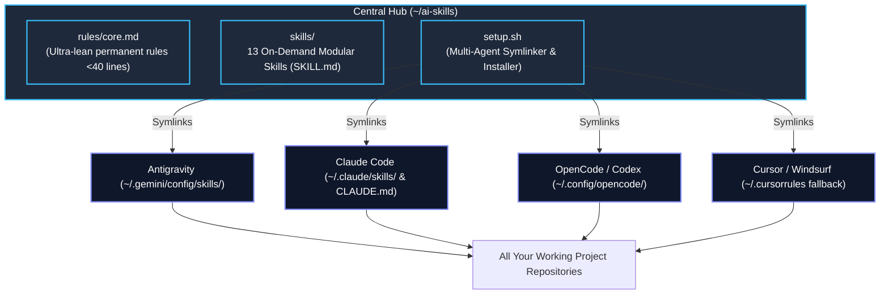

# AI Engineering Skills Hub (`ai-skills`) — v2.0

[](https://github.com/hvtrk/ai-skill-rules)
[](https://github.com/hvtrk/ai-skill-rules)
[](https://opensource.org/licenses/MIT)

A centralized, portable, and ultra-lean AI skills repository for modern software engineering workflows.

Designed for high performance, zero context bloat, and universal compatibility across **Antigravity**, **Claude Code**, **OpenCode / Codex**, and **Cursor / Windsurf**.

---

## ⚡ What's New in v2.0

| Feature | v1 (Legacy) | v2.0 (Current) |
| :--- | :--- | :--- |
| **Context Footprint** | Monolithic eager-loading of all rules & playbooks (~10k+ tokens on startup) | **Ultra-lean base rules (<40 lines)** + on-demand skill discovery (~200 tokens) |
| **Skill Format** | Flat Markdown playbooks with repeated principles | **Standardized `SKILL.md`** with semantic discovery & metadata headers |
| **Multi-Agent Setup** | Manual copy-pasting of `.agents/` folder per project | **1-Command global symlink installer (`setup.sh`)** for Antigravity, Claude, Codex, Cursor |
| **Domain Separation** | Overlapping playbooks and ad-hoc guidelines | **13 dedicated, non-overlapping skills** with strict separation of concerns |
| **Skill Authoring** | Manual file creation | **Built-in `skill-creator` meta-skill** (`/create-skill`) |

---

## 🧠 Architecture Overview



---

## 🚀 Quickstart

### 1. New Machine Setup (1 Command)
```bash
# Clone the repository
git clone git@github.com:hvtrk/ai-skill-rules.git ~/ai-skills

# Run the installer
cd ~/ai-skills
chmod +x setup.sh
./setup.sh
```
*All skills and rules immediately activate across all your agent harnesses.*

### 2. Optional: Link into a Specific Project
If a specific repository requires local `.agents/skills` or `.cursorrules`:
```bash
cd ~/ai-skills
./setup.sh --project /path/to/my-project
```

### 3. Dry-Run Mode
To preview symlinks without modifying the filesystem:
```bash
./setup.sh --dry-run
```

---

## 📁 Repository Layout

```text
~/ai-skills/
├── README.md                  # Comprehensive v2 documentation
├── setup.sh                   # Automated multi-agent symlinker & installer
├── rules/
│   └── core.md                # Ultra-compact universal engineering rules (<40 lines)
├── skills/
│   ├── fullstack-feature/     # End-to-end FastAPI + Next.js feature scaffolding
│   ├── fastapi-backend/       # Layered API: public/protected/service/repository
│   ├── nextjs-frontend/       # React 19, App Router, Tailwind v4, TanStack Query
│   ├── db-migration-schema/   # SQLModel schemas, PostgreSQL migrations & indexing
│   ├── codebase-audit-pre-push/# Pre-push git cleaner, secret scanner, and hygiene
│   ├── performance-optimizer/ # Profiling, database indexes, API latency, memoization
│   ├── systematic-debugging/  # 6-phase debugging loop & common pattern fixes
│   ├── improve-codebase-architecture/# Architectural friction scanner & seam creation
│   ├── redesign-existing-projects/   # UI/UX aesthetic audit & visual restyling
│   ├── code-review/           # Architecture consistency & PR review playbook
│   ├── project-bootstrap/     # Greenfield repository bootstrapping
│   ├── architecture-analysis/ # Codebase indexing & dependency mapping
│   └── skill-creator/         # Meta-skill for authoring and registering skills
└── adapters/
    ├── claude/                # Claude Code integration templates
    ├── antigravity/           # Antigravity config mapping
    └── cursor/                # Cursor IDE / Windsurf rules fallback
```

---

## 🛠 Available Skills Suite (13 Skills)

| Skill | Slash Command / Trigger | Domain & Responsibilities |
| :--- | :--- | :--- |
| **`fullstack-feature`** | `/fullstack-feature` | Scaffolds end-to-end features connecting FastAPI backend with Next.js frontend UI & TanStack Query. |
| **`fastapi-backend`** | `/fastapi-backend` | Generates layered FastAPI endpoints (`public.py`, `protected.py`, `service.py`, `repository.py`). |
| **`nextjs-frontend`** | `/nextjs-frontend` | Builds React 19 / Next.js App Router components with Tailwind v4 and Motion animations. |
| **`db-migration-schema`** | `/db-migration-schema` | Guides SQLModel schema creation, PostgreSQL relationships, and safe migrations. |
| **`codebase-audit-pre-push`** | `/codebase-audit-pre-push` | Sanitizes repo, removes junk files, checks secret leaks, and verifies pre-push git hygiene. |
| **`performance-optimizer`** | `/performance-optimizer` | Measures and eliminates bottlenecks in DB queries, API latency, and frontend rendering. |
| **`systematic-debugging`** | `/debug`, `/bug-hunter`, `/diagnose` | Disciplined 6-phase root-cause debugging loop with fast feedback loop creation. |
| **`improve-codebase-architecture`**| `/improve-codebase-architecture` | Deepens shallow modules, eliminates architectural friction, and establishes testable seams. |
| **`redesign-existing-projects`** | `/redesign-existing-projects` | Overhauls and modernizes UI styling, typography, color palettes, and micro-interactions. |
| **`code-review`** | `/code-review` | Thorough review for architectural consistency, security, and release readiness. |
| **`project-bootstrap`** | `/project-bootstrap` | Initializes a clean full-stack repository with boilerplate architecture. |
| **`architecture-analysis`** | `/architecture-analysis` | Analyzes codebase structure, data flows, and creates architecture documentation. |
| **`skill-creator`** | `/create-skill`, `/skill-creator` | Authors, converts, and automatically registers new on-demand skills across agent harnesses. |

---

## 🌿 Version History & Branching Strategy

This repository maintains versioned release branches:

- **`master`** — Production default branch containing the active version (v2.0).
- **`v_2`** — Active v2 development branch (Modular on-demand skills architecture).
- **`v_1`** — Legacy snapshot containing the original `.agents/` monolithic rules and playbooks.

### Creating Future Major Versions (e.g. v3):
```bash
# 1. Create a new branch
git checkout -b v_3

# 2. Make improvements & test
./setup.sh

# 3. Merge into master
git checkout master
git merge v_3
git push origin master v_3
```

---

## ➕ Adding New Skills

To add a new skill to the hub:
1. Trigger `/create-skill` in chat or create `skills/<skill-name>/SKILL.md`.
2. Add standard YAML frontmatter:
   ```markdown
   ---
   name: <skill-name>
   description: <1-2 sentence description explaining when the agent should trigger it>
   ---

   # Skill Title

   ## Step-by-Step Instructions...
   ```
3. Run `./setup.sh` to update symlinks across all agent harnesses.
4. Commit and push: `git add . && git commit -m "feat(skill): add <skill-name>" && git push origin master`.

---

## 📄 License
MIT License. Maintained by Rahul ([@hvtrk](https://github.com/hvtrk)).
