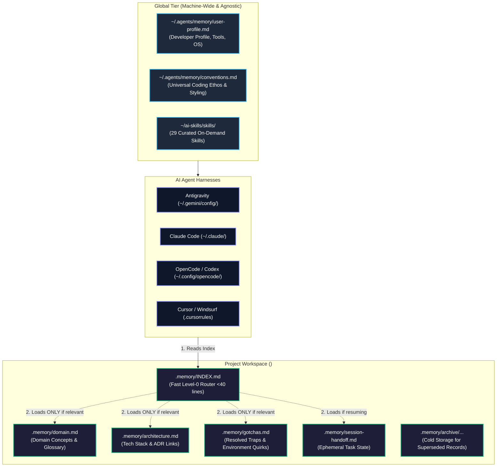

# AI Engineering Skills Hub (`ai-skills`) — v3.0

[](https://github.com/hvtrk/ai-skill-rules)
[](https://github.com/hvtrk/ai-skill-rules)
[](https://opensource.org/licenses/MIT)

A centralized, portable, and ultra-lean AI skills repository for modern software engineering workflows.

Designed for high performance, zero context bloat, and universal compatibility across **Antigravity**, **Claude Code**, **OpenCode / Codex**, and **Cursor / Windsurf**.

---

## ⚡ What's New in v3.0

| Feature | v2.0 | v3.0 (Current) |
| :--- | :--- | :--- |
| **Memory Architecture** | Global skills only (stateless across sessions) | **Two-Tier Persistent Memory**: Machine-wide conventions (`~/.agents/memory/`) + isolated workspace memory (`.memory/`) |
| **Context Management** | Full repo inspection per task | **Hierarchical Level-0 Router (`.memory/INDEX.md` <40 lines)**; topic files loaded on-demand |
| **Session Continuity** | Chat transcript dependent | **Dedicated ephemeral `session-handoff.md`** with automatic graduation to permanent records upon task completion |
| **Project Isolation** | No local memory standard | **Strict project workspace boundary**: client project memory stays isolated, with optional git tracking or `.gitignore` |
| **Compaction & Anti-Drift** | Manual | **Append-and-replace compaction** with cold storage `.memory/archive/` (prevents hallucinating on obsolete notes) |
| **Curated Suite** | 28 skills | **29 skills** including the new `project-memory` skill |

---

## 🧠 System Architecture



---

## 🚀 Quickstart

### 1. Global Installation (1 Command)
```bash
# Clone the repository
git clone git@github.com:hvtrk/ai-skill-rules.git ~/ai-skills

# Run the installer (seeds ~/.agents/memory and links all harnesses)
cd ~/ai-skills
chmod +x setup.sh
./setup.sh --global
```
*Skills and the global memory tier immediately activate across Antigravity, Claude Code, OpenCode, and `~/.agents`.*

### 2. Initialize Memory in a Project Workspace
To bootstrap the `.memory/` structure into any project:
```bash
# From ~/ai-skills:
./setup.sh --memory-init /path/to/my-project

# Or from anywhere via project flag:
~/ai-skills/setup.sh --project /path/to/my-project
```
*(Idempotent: If `.memory/` already exists, existing documentation is safely preserved.)*

### 3. Check Sync & Memory Status
```bash
~/ai-skills/setup.sh --status
```

### 4. Importing New Skills from `npx skills add`
```bash
~/ai-skills/setup.sh --import
~/ai-skills/setup.sh --global
```

---

## 🗂 Memory Management & Usage Guide

The memory architecture solves context window exhaustion and cross-project pollution using a **Hierarchical (Option C)** retrieval model.

### 1. The Two Tiers

| Tier | Path | Purpose | Git Tracking |
| :--- | :--- | :--- | :--- |
| **Global Memory** | `~/.agents/memory/` | Machine-wide developer profile (`user-profile.md`) and universal coding conventions (`conventions.md`). | Machine-local (agnostic) |
| **Project Memory** | `<project-root>/.memory/` | Workspace-specific domain terms, tech stack patterns, gotchas, and session handoffs. | Committed with repo (personal) OR gitignored (client) |

### 2. File Taxonomy in `<project-root>/.memory/`

```text
.memory/
├── INDEX.md              # Compact Level-0 router (<40 lines). Always read first.
├── domain.md             # Core business entities, glossary, ubiquitous language.
├── architecture.md       # Tech stack, module boundaries, data flows, key ADR links.
├── gotchas.md            # Non-obvious edge cases, environment quirks, resolved traps.
├── session-handoff.md    # Ephemeral active state: goal, dead-ends, next steps.
└── archive/              # Cold storage: superseded decisions (never queried in daily work).
```

### 3. Memory Operations Workflow

- **Startup / Discovery**: The agent checks `~/.agents/memory/conventions.md` and `.memory/INDEX.md`. If a task is trivial or unrelated to architectural patterns, it stops there (zero token waste).
- **On-Demand Drilldown**: If the task involves domain entities or system boundaries, the agent reads only `domain.md` or `architecture.md`.
- **Session Continuity**: When stopping mid-task, the agent writes to `session-handoff.md` (recording what was tried, dead ends, and immediate next steps).
- **Memory Graduation**: Upon task completion, permanent discoveries are moved to `architecture.md` / `gotchas.md`, and `session-handoff.md` is reset to blank.
- **Compaction & Invalidation**: When a decision or architectural pattern is replaced, the agent overwrites the active file and archives the obsolete record in `.memory/archive/` to prevent hallucinations.

### 4. Git Isolation Strategy

- **Personal / Open Source Repos**: Commit `.memory/` to git so memory travels with the project, branches, and team.
- **Client / Confidential Repos**: Add `.memory/` to `.gitignore` (template provided in `templates/memory/.gitignore`).

---

## 🛠 Available Skills Suite (29 Curated Skills)

| Category | Skill | Trigger / Command | Description |
| :--- | :--- | :--- | :--- |
| **Memory** | `project-memory` | `/memory` | Manages two-tier persistent memory, session handoffs, compaction, and graduation. |
| **Fullstack** | `fullstack-feature` | `/fullstack-feature` | Scaffolds end-to-end features connecting FastAPI backend with Next.js frontend UI & TanStack Query. |
| **Backend** | `fastapi-backend` | `/fastapi-backend` | Generates layered FastAPI endpoints (`public.py`, `protected.py`, `service.py`, `repository.py`). |
| **Frontend** | `nextjs-frontend` | `/nextjs-frontend` | Builds React 19 / Next.js App Router components with Tailwind v4 and Motion animations. |
| **Database** | `db-migration-schema` | `/db-migration-schema` | Guides SQLModel schema creation, PostgreSQL relationships, and safe migrations. |
| **Database** | `supabase` | `/supabase` | Supabase database, auth, SSR, storage, vectors, edge functions, and CLI workflows. |
| **Database** | `supabase-postgres-best-practices` | `postgres optimization` | Postgres query profiling, index strategies, connection limits, and RLS security. |
| **UI Design** | `design-it` | `/design-it` | 30 production UI aesthetics (Bento, Neomorphism, Brutalism, Minimal, Glassmorphism, etc.). |
| **UI Design** | `redesign-existing-projects` | `/redesign-existing-projects` | Overhauls and modernizes UI styling, typography, color palettes, and micro-interactions. |
| **Quality** | `codebase-audit-pre-push` | `/codebase-audit-pre-push` | Sanitizes repo, removes junk files, checks secret leaks, and verifies pre-push hygiene. |
| **Quality** | `performance-optimizer` | `/performance-optimizer` | Measures and eliminates bottlenecks in DB queries, API latency, and frontend rendering. |
| **Quality** | `systematic-debugging` | `/debug`, `/bug-hunter` | Disciplined 6-phase root-cause debugging loop with fast feedback loop creation. |
| **Quality** | `logic-lens` | `/logic-lens` | Deep formal reasoning and logical verification of edge cases, security, and contracts. |
| **Quality** | `code-review` | `/code-review` | Thorough review for architectural consistency, security, and release readiness. |
| **Architecture** | `improve-codebase-architecture`| `/improve-codebase-architecture` | Deepens shallow modules, eliminates architectural friction, and establishes testable seams. |
| **Architecture** | `architecture-analysis` | `/architecture-analysis` | Analyzes codebase structure, data flows, and creates architecture documentation. |
| **Architecture** | `domain-modeling` | `/domain-modeling` | Builds and sharpens domain models, CONTEXT.md, and Architectural Decision Records (ADRs). |
| **Engineering** | `tdd` | `/tdd` | Test-driven development red-green-refactor cycle with unit and integration tests. |
| **Engineering** | `prototype` | `/prototype` | Builds throwaway prototypes to flesh out state/business logic or UI variations. |
| **Engineering** | `to-spec` | `/to-spec` | Synthesizes chat conversation into actionable technical specifications. |
| **Engineering** | `to-tickets` | `/to-tickets` | Breaks down plans/specs into tracer-bullet tickets with dependency edges. |
| **Engineering** | `project-bootstrap` | `/project-bootstrap` | Initializes a clean full-stack repository with boilerplate architecture. |
| **Engineering** | `technical-change-tracker` | `/track-changes` | Structured JSON change logs and state machine handoffs between agent sessions. |
| **Agent Tooling** | `skill-creator` | `/create-skill` | Authors, converts, and automatically registers new on-demand skills. |
| **Agent Tooling** | `skill-harness-sync` | `/skill-harness-sync` | Audits, imports from `npx skills add`, and synchronizes across all agent harnesses. |
| **Agent Tooling** | `skill-development` | `skill development` | Best practices for building robust Claude Code plugins and tool workflows. |
| **Agent Tooling** | `skill-check` | `/skill-check` | Validates skills against the agentskills specification to catch structural issues. |
| **Agent Tooling** | `writing-for-agents` | `writing for agents` | Rules and guidelines for authoring agent instruction files (`AGENTS.md`, `CLAUDE.md`). |
| **Agent Tooling** | `mcp-integration` | `mcp integration` | Guidance for connecting and configuring Model Context Protocol servers. |

---

## 🌿 Version History & Branching Strategy

This repository maintains versioned release branches:

- **`master`** — Production default branch containing the active release (v3.0).
- **`v_3`** — Active v3 development branch (Two-Tier Hierarchical Markdown Memory Architecture).
- **`v_2`** — Modular on-demand skills architecture snapshot.
- **`v_1`** — Legacy snapshot containing the original `.agents/` monolithic rules and playbooks.

> [!IMPORTANT]
> **Branching Rule**: All changes, additions, and documentation updates MUST be committed to the development branch (e.g. `v_3`) first and then merged into `master`. No direct commits or pushes to `master`.

---

## 📄 License
MIT License. Maintained by Rahul ([@hvtrk](https://github.com/hvtrk)).
