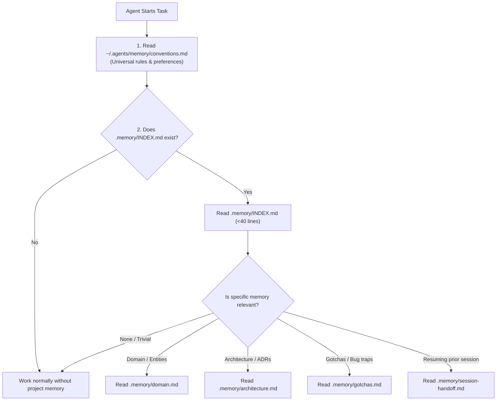
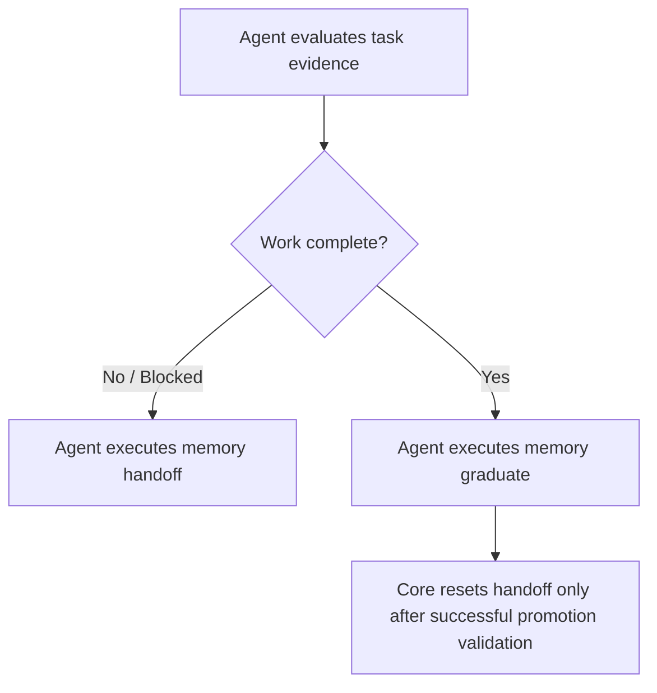

# AI Agent Memory Lifecycle & Feature Completion Guide

A reference guide explaining how AI agent memory works, how it updates during development, and how agents determine that a feature is complete and ready for memory graduation.

> **Implementation status:** Phase 3 implements deterministic lifecycle mutations (`memory update`, `memory handoff`, `memory graduate`, and `memory archive`) alongside `memory init`, `memory check` (structure, headings, INDEX size limit, YAML frontmatter, archive metadata, local links, handoff freshness, locking safety), and lazy `memory retrieve`. Semantic decision-making (what is durable, graduation selection, obsolescence) remains agent-guided, while validation, locking, atomic writes, duplicate/conflict detection, and multi-file staged rollbacks are enforced deterministically by the filesystem-only Memory Core.

---

## 1. The Two-Tier Hierarchical Memory Architecture

To prevent context window bloat and avoid cross-project contamination, memory is divided into two distinct tiers:

1. **Global Memory (`~/.agents/memory/`)**:
   - Machine-wide developer profile (`user-profile.md`) and universal coding conventions (`conventions.md`).
2. **Project Memory (`<project-root>/.memory/`)**:
   - Workspace-isolated domain knowledge, architectural decisions, non-obvious gotchas, and session handoffs.

### Project Memory Directory Structure

```
<project-root>/.memory/
├── INDEX.md              # Compact router (< 40 lines) read on startup
├── domain.md             # Domain entities, glossary, ubiquitous language
├── architecture.md       # Stack, design decisions, invariants, API contracts
├── gotchas.md            # Non-obvious quirks, bug traps, environment traps
├── session-handoff.md    # Ephemeral state (wiped/graduated on task completion)
└── archive/              # Superseded historical records (YYYY-MM-DD-<topic>-<id>.md)
```

---

## 2. Memory Discovery & Retrieval Workflow

Rather than loading every memory file into every prompt (which wastes tokens and causes hallucination), agents use **Hierarchical Lazy Retrieval**:



---

## 3. How Memory Updates Work (Phase 3 Lifecycle Operations)

### A. Durable Topic Update (`memory update`)
When an agent determines that a non-obvious bug trap, environment quirk, or architectural decision is durable project knowledge:
- Execute `memory update <project> --input plan.json` (or `--topic <topic> --input note.md`).
- Input contract:
  ```json
  {
    "operation": "update",
    "topic": "architecture",
    "title": "ADR-0003 Distributed Caching",
    "section": "Key Architectural Decisions",
    "content": "- **[ADR-0003]**: Use Redis for distributed token caching with 5-minute TTL.",
    "metadata": { "created": "2026-08-28", "updated": "2026-08-28", "source": "design-review" }
  }
  ```
- **Deterministic Core Protections**: Acquires lock, detects exact duplicates and title conflicts, stages atomic write under specified section or file end, validates memory structure post-mutation, and automatically rolls back if validation fails.

### B. Session Handoff (`memory handoff`)
When a task is paused, interrupted, or approaching token limits:
- Execute `memory handoff <project> --input handoff.json` (or with a Markdown file).
- Input contract:
  ```json
  {
    "operation": "handoff",
    "goal": "Refactor token bucket algorithm",
    "files_in_progress": ["src/ratelimit.py", "tests/test_ratelimit.py"],
    "build_status": "Tests passing, lint clean",
    "dead_ends": ["Fixed window counter caused stampedes"],
    "next_step": "Benchmark under 10k rps load"
  }
  ```
- **Deterministic Core Protections**: Validates mandatory goal and next step, replaces `session-handoff.md` atomically under lock, and verifies template structure.

### C. Memory Graduation (`memory graduate`)
When a feature is finished and verified:
- Execute `memory graduate <project> --plan plan.json`.
- Input contract:
  ```json
  {
    "operation": "graduate",
    "source": "session-handoff.md",
    "promotions": [
      {
        "topic": "architecture",
        "title": "Billing Engine",
        "section": "System Structure & Boundaries",
        "content": "- `src/billing/...`: Handles Stripe webhook reconciliation and tax calculation."
      },
      {
        "topic": "gotchas",
        "title": "Stripe Webhook Idempotency",
        "section": "Critical Traps",
        "content": "- **[Stripe Webhook Idempotency]**: Stripe may retry webhooks up to 72 hours; deduplicate by event_id."
      }
    ],
    "reset_handoff": true
  }
  ```
- **Deterministic Core Protections**: Applies all promotions under project lock, validates all resulting durable files, and only resets `session-handoff.md` to template after all durable updates pass validation. If any promotion fails, all files roll back transactionally and the handoff is preserved.

### D. Superseded Record Archiving (`memory archive`)
When an existing architectural pattern or gotcha is obsolete:
- Execute `memory archive <project> --input archive.json` (or `--topic <topic> --superseded-by <ref> --input entry.md`).
- Input contract:
  ```json
  {
    "operation": "archive",
    "source_topic": "architecture",
    "title": "Legacy Auth Deprecated",
    "content": "- **[Legacy Auth]**: Basic HTTP authentication headers.",
    "superseded_by": "ADR-0002",
    "reason": "Replaced by OAuth2 PKCE",
    "archive_date": "2026-08-28"
  }
  ```
- **Deterministic Core Protections**: Verifies source content exists in the active topic file, generates a collision-free `YYYY-MM-DD-<topic>-<slug>.md` archive record with required YAML frontmatter (`archive_date`, `source_topic`, `superseded_by`), strips the obsolete content from the active file, and validates both files before committing.

---

## 4. Completion and Graduation Are Agent-Guided

The Memory Core does not detect feature completion, run a Definition of Done gate, or integrate a state machine. The agent evaluates the task's requested acceptance criteria and verification evidence, then deliberately chooses whether to graduate durable knowledge or retain an unfinished handoff.



### Key Completion Triggers

1. **Task evidence**: The agent considers the task's acceptance criteria and relevant verification.
2. **Knowledge classification**: The agent decides whether a discovery is durable project knowledge, unfinished work, user-level knowledge, a generalized procedure, or disposable.
3. **Explicit action**: The agent chooses an appropriate memory operation (`update`, `handoff`, `graduate`, `archive`). The core does not automatically trigger graduation or modify `INDEX.md`.

---

## 5. Summary Matrix: Complete vs. Incomplete Tasks

| Scenario | Agent State | Memory Action |
| :--- | :--- | :--- |
| **Feature Fully Complete** | All tests pass; criteria fulfilled | **Graduate Memory**: `memory graduate <project> --plan plan.json` moves permanent knowledge into `architecture.md`, `domain.md`, `gotchas.md` and resets `session-handoff.md`. |
| **Feature Incomplete / Interrupted** | Hit token limit, waiting for user input, or stopping mid-task | **Session Handoff**: `memory handoff <project> --input handoff.json` updates `session-handoff.md` with active files, current goal, dead ends, and exact next step. |
| **Architectural Change** | New service/library/schema added | **Update Active File**: `memory update <project> --input update.json`; archive superseded records using `memory archive <project> --input archive.json`. |
