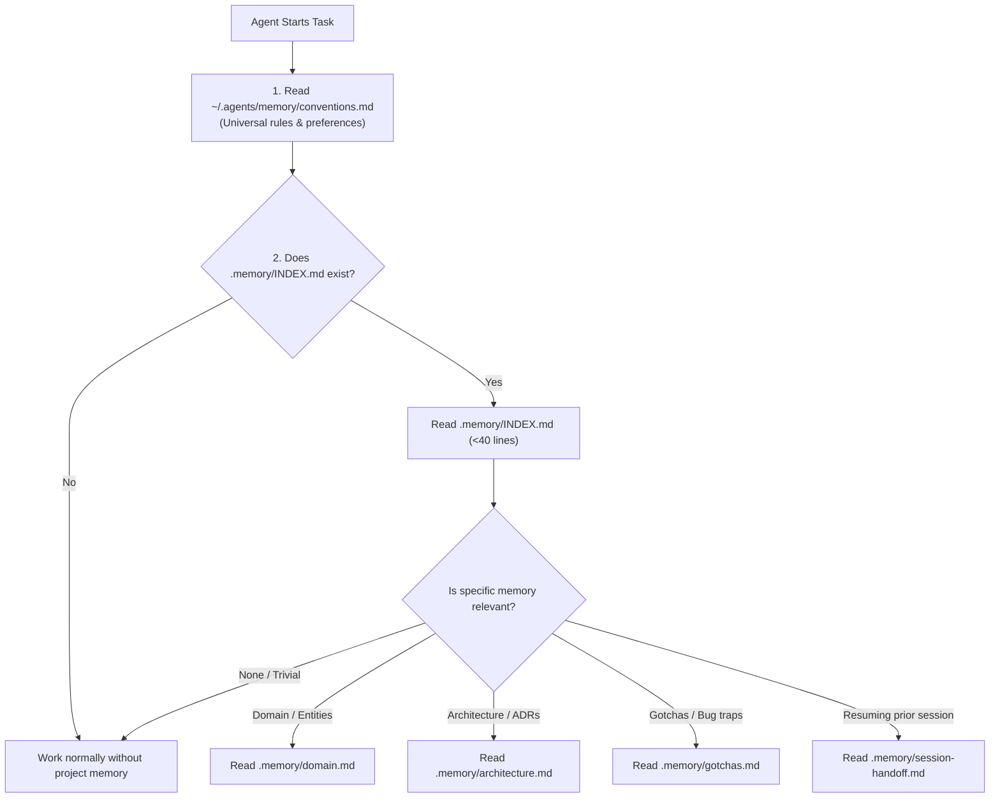
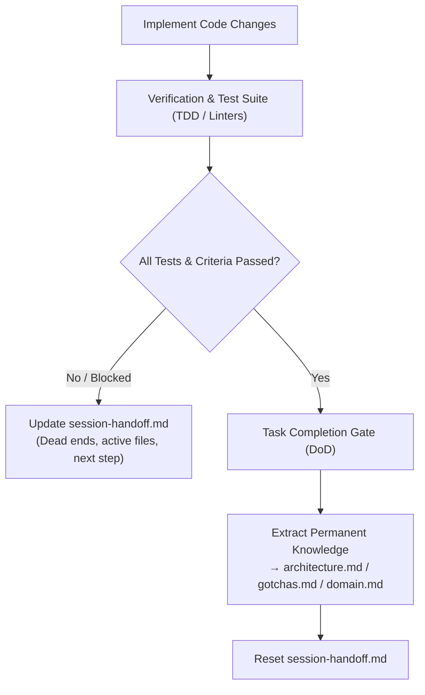

# AI Agent Memory Lifecycle & Feature Completion Guide

A reference guide explaining how AI agent memory works, how it updates during development, and how agents determine that a feature is complete and ready for memory graduation.

---

## 1. The Two-Tier Hierarchical Memory Architecture

To prevent context window bloat and avoid cross-project contamination, memory is divided into two distinct tiers:

1. **Global Memory (`~/.agents/memory/`)**:
   - Machine-wide developer profile (`user-profile.md`) and universal coding conventions (`conventions.md`).
2. **Project Memory (`<project-root>/.memory/`)**:
   - Workspace-isolated domain knowledge, architectural decisions, non-obvious gotchas, and session handoffs.

### Project Memory Directory Structure

```
<project-root>/.memory/
├── INDEX.md              # Compact router (< 40 lines) read on startup
├── domain.md             # Domain entities, glossary, ubiquitous language
├── architecture.md       # Stack, design decisions, invariants, API contracts
├── gotchas.md            # Non-obvious quirks, bug traps, environment traps
├── session-handoff.md    # Ephemeral state (wiped/graduated on task completion)
└── archive/              # Superseded historical records (YYYY-MM-<topic>.md)
```

---

## 2. Memory Discovery & Retrieval Workflow

Rather than loading every memory file into every prompt (which wastes tokens and causes hallucination), agents use **Hierarchical Lazy Retrieval**:



---

## 3. How Memory Updates Work (Lifecycle Operations)

### A. In-Flight Logging (During Execution)
When an agent encounters a non-obvious bug trap, environment quirk, or library gotcha during development:
- It records the gotcha in `.memory/gotchas.md` immediately so future subagents or sessions do not repeat the mistake.
- If an approach fails, it logs the approach under `Dead Ends` in `.memory/session-handoff.md`.

### B. Append-and-Replace Compaction
- Agents **never** blindly append contradictory notes to active files.
- Active files (`architecture.md`, `domain.md`, `gotchas.md`) only contain current invariants and active patterns.
- If a prior architectural decision is superseded:
  1. The superseded record is moved to `.memory/archive/YYYY-MM-<topic>.md`.
  2. A frontmatter tag is attached: `superseded-by: <Commit/PR/Decision>`.

### C. Session Handoff (`/memory handoff`)
When a task is paused, interrupted, or approaching token limits:
- The agent updates `.memory/session-handoff.md` with:
  - **Current Goal**: Exact objective being pursued.
  - **Modified Files**: List of active files touched.
  - **Dead Ends**: Approaches that failed and should not be retried.
  - **Immediate Next Step**: The exact line, function, or command to execute next.

### D. Memory Graduation (`/memory graduate`)
When a feature is finished and verified:
1. **Extract Permanent Knowledge**:
   - Move new architectural patterns & conventions to `architecture.md`.
   - Move discovered bug traps and quirks to `gotchas.md`.
   - Move new domain models and business terms to `domain.md`.
2. **Reset Ephemeral State**:
   - Clear `session-handoff.md` back to the clean template so obsolete short-term state does not mislead subsequent sessions.

---

## 4. How the Agent Knows a Feature Is Complete

The agent detects completion using a structured **Definition of Done (DoD)** and state machine verification rather than guessing:



### Key Completion Triggers

1. **Deterministic Verification Pass**:
   - All unit, integration, and end-to-end tests pass.
   - Linters and type checkers report zero errors.
   - All acceptance criteria defined in the user prompt or implementation plan are met.
2. **Operating Rules Enforcement (Definition of Done Gate)**:
   - Operating rules (e.g., [Rule 8 in `rules/core.md`](file:///Users/rahul/ai-skills/rules/core.md#L12)) mandate checking memory as the final step of feature execution.
3. **Structured State Machine**:
   - In tracked workflows, the state transitions through explicit stages:
     $$\text{planned} \longrightarrow \text{in\_progress} \longrightarrow \text{implemented} \longrightarrow \text{tested} \longrightarrow \text{closed}$$
   - Reaching `tested` / `closed` triggers memory graduation.

---

## 5. Summary Matrix: Complete vs. Incomplete Tasks

| Scenario | Agent State | Memory Action |
| :--- | :--- | :--- |
| **Feature Fully Complete** | All tests pass; criteria fulfilled | **Graduate Memory**: Move permanent knowledge into `architecture.md`, `domain.md`, `gotchas.md`; reset `session-handoff.md`. |
| **Feature Incomplete / Interrupted** | Hit token limit, waiting for user input, or stopping mid-task | **Session Handoff**: Update `session-handoff.md` with active files, current goal, dead ends, and exact next line/function to touch. |
| **Architectural Change** | New service/library/schema added | **Update Active File**: Modify `architecture.md` / `domain.md`, archive superseded records to `.memory/archive/`. |

