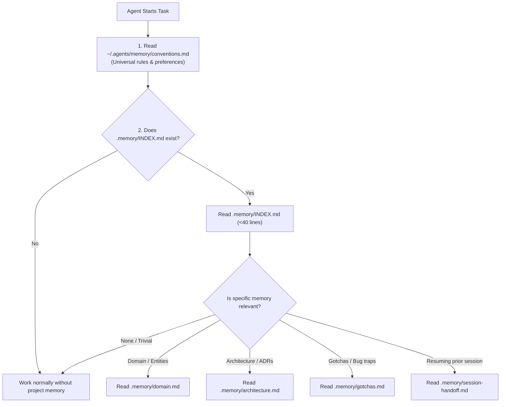

# Project Memory Skill

A disciplined protocol for managing two-tier persistent memory without context bloat:

1. **Global Memory (`~/.agents/memory/`)**: Machine-wide developer profile and universal coding conventions.
2. **Project Memory (`<project-root>/.memory/`)**: Workspace-isolated domain models, architecture patterns, gotchas, and session handoffs.

---

## 🧭 Memory Discovery & Retrieval Workflow



---

## 🛠 Commands & Operations

### 1. Initialize Memory (`memory init`)

When starting a project or setting up memory:

Use `python3 ~/ai-skills/scripts/memory.py init <project-root>`.

The Phase 1 core validates the path, stages the required visible templates, creates `archive/`, preserves existing content, and reports created or preserved files. It does not inspect the project to populate `architecture.md`, overwrite existing memory, or apply `.gitignore`; version-control policy remains user-managed. Use `--repair` only to create missing required paths in an existing `.memory/` directory.

### 2. Check and Retrieve Memory (`memory check`, `memory retrieve`)

- `memory check <project-root>` validates deterministic structure, readable required files, template headings, duplicate headings, the 40-line `INDEX.md` limit, YAML frontmatter, archive metadata and filename conventions, local Markdown references, and session-handoff freshness without rewriting files.
- `memory retrieve <project-root>` loads global conventions when present, the project index when present, and only explicitly requested topic files. Add `--profile` to include `user-profile.md`; archive is never loaded by default.

### 3. Update Memory (`memory update`)

When introducing a new architectural pattern, discovering a non-obvious gotcha, or defining a domain term:

Use `python3 ~/ai-skills/scripts/memory.py update <project-root> --input plan.json` (or `--topic <topic> --input note.md`).

JSON plan format:

```json
{
  "operation": "update",
  "topic": "architecture",
  "title": "ADR-0003 Distributed Caching",
  "section": "Key Architectural Decisions",
  "content": "- **[ADR-0003]**: Use Redis for distributed token caching with 5-minute TTL.",
  "metadata": {
    "created": "2026-08-28",
    "updated": "2026-08-28",
    "source": "design-doc"
  }
}
```

The Core acquires a lock, checks for duplicates or conflicts, inserts content under the target section (or file end), applies optional frontmatter metadata, and verifies post-mutation integrity before committing.

### 4. Session Handoff (`memory handoff`)

When wrapping up an incomplete task or preparing for session handoff:

Use `python3 ~/ai-skills/scripts/memory.py handoff <project-root> --input handoff.json`.

JSON input format:

```json
{
  "operation": "handoff",
  "goal": "Refactor token bucket algorithm",
  "files_in_progress": ["src/ratelimit.py", "tests/test_ratelimit.py"],
  "build_status": "Tests passing, lint clean",
  "dead_ends": ["Fixed window counter caused stampedes"],
  "next_step": "Benchmark under 10k rps load"
}
```

The Core validates required fields (`goal`, `next_step`), formats them into the standard template, and atomically overwrites `.memory/session-handoff.md`.

### 5. Memory Graduation (`memory graduate`)

When a feature, fix, or session is completed and verified:

Use `python3 ~/ai-skills/scripts/memory.py graduate <project-root> --plan graduation_plan.json`.

JSON graduation plan format:

```json
{
  "operation": "graduate",
  "source": "session-handoff.md",
  "promotions": [
    {
      "topic": "architecture",
      "title": "Billing Engine",
      "section": "System Structure & Boundaries",
      "content": "- `src/billing/...`: Handles Stripe webhook reconciliation and tax calculation."
    },
    {
      "topic": "gotchas",
      "title": "Stripe Webhook Idempotency",
      "section": "Critical Traps",
      "content": "- **[Stripe Webhook Idempotency]**: Stripe may retry webhooks up to 72 hours; deduplicate by event_id."
    }
  ],
  "reset_handoff": true
}
```

The Core promotes each entry to its target durable topic, validates all modified durable topic files, and resets `session-handoff.md` to a clean template only after all promotions succeed.

### 6. Memory Archive (`memory archive`)

When an existing architectural pattern or gotcha is obsolete:

Use `python3 ~/ai-skills/scripts/memory.py archive <project-root> --input archive_plan.json`.

JSON archive format:

```json
{
  "operation": "archive",
  "source_topic": "architecture",
  "title": "Legacy Auth Deprecated",
  "content": "- **[Legacy Auth]**: Basic HTTP authentication headers.",
  "superseded_by": "ADR-0002",
  "reason": "Replaced by OAuth2 PKCE",
  "archive_date": "2026-08-28"
}
```

The Core verifies that the content exists in the active topic file, generates a collision-free archive file (`YYYY-MM-DD-<topic>-<slug>.md`) with provenance frontmatter (`archive_date`, `source_topic`, `superseded_by`), removes the content from the active file, and validates both files.

---

## 🔒 Memory Safety Principles

1. **Strict Active Isolation**: Agents MUST ONLY read active files (`INDEX.md`, `domain.md`, `architecture.md`, `gotchas.md`, `session-handoff.md`). Never load `.memory/archive/` into everyday prompts.
2. **Compact Index**: Keep `.memory/INDEX.md` under 40 lines. It is a router, not a content dump.
3. **No Cross-Contamination**: Project memory stays strictly inside `.memory/` of that project repository.
4. **Deterministic Core / Agent Guidance**: The agent decides knowledge significance, destinations, and graduation readiness; the Core guarantees deterministic persistence, locking, duplicate/conflict prevention, and safe rollbacks.
