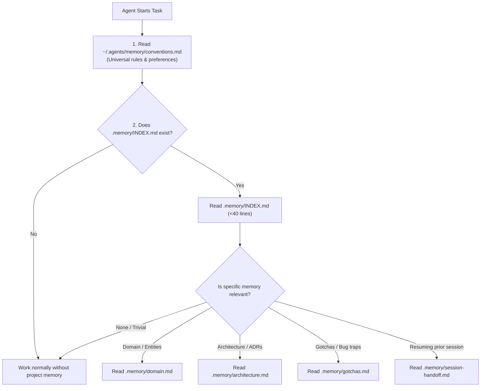

# Project Memory Skill

A disciplined protocol for managing two-tier persistent memory without context bloat:

1. **Global Memory (`~/.agents/memory/`)**: Machine-wide developer profile and universal coding conventions.
2. **Project Memory (`<project-root>/.memory/`)**: Workspace-isolated domain models, architecture patterns, gotchas, and session handoffs.

---

## 🧭 Memory Discovery & Retrieval Workflow

---

## 🛠 Commands & Operations

### 1. Initialize Memory (`/memory init`)

When starting a project or setting up memory:

1. Check if `.memory/` already exists in `<project-root>`. If it exists, **do not overwrite**.
2. Copy templates from `~/ai-skills/templates/memory/` into `<project-root>/.memory/`.
3. Create empty `.memory/archive/` directory.
4. Populate `architecture.md` with initial stack and framework details from the repo.

### 2. Update Memory (`/memory update`)

When introducing a new architectural pattern, discovering a non-obvious gotcha, or defining a domain term:

- **Append-and-Replace**: Never append contradictory notes. Edit the active topic file (`domain.md`, `architecture.md`, `gotchas.md`) directly.
- **Relocate to Archive**: If an existing decision is being replaced or superseded:
  1. Move the old text to `.memory/archive/YYYY-MM-<topic>.md`.
  2. Add a frontmatter note: `superseded-by: <PR/Commit/Decision>`.

### 3. Session Handoff (`/memory handoff`)

When wrapping up an incomplete task or preparing for session handoff:

1. Update `.memory/session-handoff.md` with:
   - **Current Goal**: The exact objective.
   - **Modified Files**: List of active files touched.
   - **Dead Ends**: Specific approaches that failed and should not be retried.
   - **Immediate Next Step**: The exact line/function to touch next.

### 4. Memory Graduation & Task Completion (`/memory graduate`)

When a feature, fix, or session is completed:

1. **Extract Permanent Knowledge**:
   - Move permanent architectural decisions to `architecture.md`.
   - Move non-obvious bug traps and environment quirks to `gotchas.md`.
   - Move new domain entities and terms to `domain.md`.
2. **Reset Ephemeral State**: Clear `session-handoff.md` back to the clean template.

---

## 🔒 Memory Safety Principles

1. **Strict Active Isolation**: Agents MUST ONLY read active files (`INDEX.md`, `domain.md`, `architecture.md`, `gotchas.md`, `session-handoff.md`). Never load `.memory/archive/` into everyday prompts.
2. **Compact Index**: Keep `.memory/INDEX.md` under 40 lines. It is a router, not a content dump.
3. **No Cross-Contamination**: Project memory stays strictly inside `.memory/` of that project repository.
